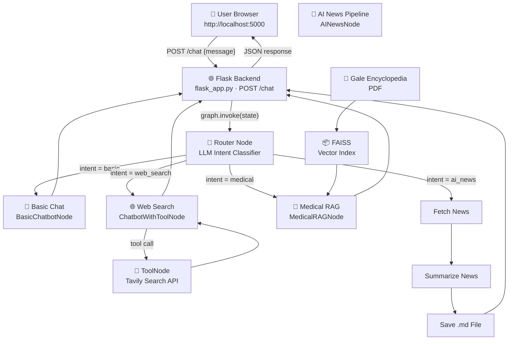

# 🤖 AgentIQ — End-to-End Multi-Agent AI System

## 🔧 Deployed on AWS EC2 with Jenkins CI/CD Pipeline

⚡ Production Deployment | 🧠 4-Agent Router | 🏥 Medical RAG | 🌐 Flask Backend | 🐳 Dockerized | 🔁 Automated CI/CD

---

## 🌟 Project Overview

**AgentIQ** is a production-grade **Multi-Agent AI system** built with **LangGraph** for orchestration and **Flask** as the backend. An intelligent **Supervisor Router** dynamically classifies user intent and delegates tasks to one of four specialized agents — including a brand-new **Medical RAG Agent** that answers health queries directly from the *Gale Encyclopedia of Medicine* PDF using FAISS vector search.

### Key Capabilities

| Capability | Description |
|-----------|-------------|
| 🔀 **Semantic Routing** | LLM-based intent classifier routes queries to the right agent automatically |
| 💬 **Basic Chat** | General-purpose conversational agent powered by Groq LLaMA |
| 🌐 **Web-Augmented Reasoning** | Real-time web search via Tavily API using a ReAct tool-calling loop |
| 📰 **AI News ETL Pipeline** | Fetches, summarizes, and saves AI news as Markdown reports |
| 🏥 **Medical RAG Agent** | Answers medical questions from a local PDF using FAISS + HuggingFace embeddings |
| 🎨 **Rich Chat UI** | Dark-themed, animated HTML/JS frontend served by Flask |

---

## 🏗️ System Architecture

The application has three layers: **Browser → Flask → LangGraph Graph**.



---

## 🧠 Agents — Deep Dive

### 1️⃣ Supervisor Router (The Brain)
**File:** `src/langgraphagenticai/nodes/router_node.py`

Uses the **Groq LLaMA 3.1** model to classify every incoming message into one of four intents:

| Intent | Triggered When |
|--------|---------------|
| `basic` | General chat, greetings, general knowledge |
| `web_search` | Weather, stock prices, current events, sports scores |
| `ai_news` | User asks for AI news (Daily / Weekly / Monthly) |
| `medical` | Diseases, symptoms, treatments, medications, anatomy |

The router responds with a strict JSON: `{"intent": "medical", "frequency": ""}` — this updates the shared **State** dict and LangGraph uses it to route to the correct node via a **conditional edge**.

---

### 2️⃣ Basic Chatbot
**File:** `src/langgraphagenticai/nodes/basic_chatbot_node.py`

Passes the full conversation history (`state["messages"]`) directly to the Groq LLM. Supports multi-turn dialogue because all previous messages are included in every call.

---

### 3️⃣ Web Search Agent (ReAct Loop)
**File:** `src/langgraphagenticai/nodes/chatbot_with_Tool_node.py`

An autonomous **ReAct (Reasoning + Acting)** agent:

```
User question → LLM decides to call Tavily → Tavily fetches web results
→ LLM reads results → generates final answer → END
```

- The LLM is **bound to the Tavily tool** via `llm.bind_tools(tools)`
- `tools_condition` (LangGraph built-in) checks if the LLM made a tool call
- The loop repeats until the LLM has enough information to answer without calling a tool

---

### 4️⃣ AI News ETL Pipeline
**File:** `src/langgraphagenticai/nodes/ai_news_node.py`

A 3-node sequential pipeline:

1. **`fetch_news`** — Calls `TavilyClient.search()` with `topic="news"` and a time range (`d/w/m`) based on the requested frequency. Returns up to 20 articles.
2. **`summarize_news`** — Sends all articles to Groq LLM with a formatting prompt. Output is a Markdown document sorted by date with source URLs.
3. **`save_result`** — Writes the summary to `./AINews/{frequency}_summary.md`. Flask reads this file and returns it to the browser.

---

### 5️⃣ Medical RAG Agent *(New)*
**File:** `src/langgraphagenticai/nodes/medical_rag_node.py`

**RAG = Retrieval-Augmented Generation** — the agent retrieves exact passages from the encyclopedia before generating an answer, ensuring accuracy over hallucination.

#### First-run (index building, ~1-2 min):
```
PDF → PyPDFLoader → text chunks (1000 chars, 150 overlap)
    → HuggingFaceEmbeddings (all-MiniLM-L6-v2, local CPU)
    → FAISS vector index → saved to ./medical_rag_index/
```

#### Every query (milliseconds after first run):
```
User query → embed query → FAISS similarity search (top-5 chunks)
           → chunks + query → Groq LLM → structured answer + citations + disclaimer
```

> **Note:** The FAISS index is built once and cached to disk. On all subsequent restarts, it loads in milliseconds — no re-indexing required.

---

## 🎨 Frontend (Flask-Served Chat UI)
**File:** `frontend/index.html`

A fully self-contained dark-themed chat interface served directly by Flask at `/`:

- **Agent badges** — color-coded labels show which agent handled each response
  - 🏥 Medical RAG (green) · 📰 AI News (amber) · 🌐 Web Search (blue) · 💬 Chat (purple)
- **Markdown rendering** via `marked.js`
- **Typing animation** while the agent is processing
- **Quick-action chips** to jumpstart conversations
- **Enter to send**, Shift+Enter for new line

---

## 🛠️ Tech Stack

| Layer | Technology |
|-------|-----------|
| **Backend Framework** | Flask + Flask-CORS |
| **Agent Orchestration** | LangGraph |
| **LLM Toolkit** | LangChain |
| **LLM Engine** | Groq (LLaMA 3.1-8B-Instant) |
| **Web Search** | Tavily API |
| **Vector Database** | FAISS (Facebook AI Similarity Search) |
| **Embedding Model** | HuggingFace `all-MiniLM-L6-v2` (local, no API key) |
| **PDF Parsing** | PyPDFLoader (pypdf) |
| **Text Splitting** | RecursiveCharacterTextSplitter (langchain-text-splitters) |
| **Frontend** | Vanilla HTML + CSS + JavaScript + marked.js |
| **Infrastructure** | Docker, AWS EC2 |
| **CI/CD** | Jenkins |

---

## 📂 Project Structure

```
AINEWSAgentic/
│
├── flask_app.py                        # Flask server — API + static file serving
├── app.py                              # Entry point (imports and runs flask_app)
├── .env                                # API keys (GROQ_API_KEY, TAVILY_API_KEY)
├── requirements.txt                    # Python dependencies
├── Dockerfile                          # Container definition
├── Jenkinsfile                         # CI/CD pipeline definition
│
├── frontend/
│   └── index.html                      # Full chat UI (HTML + CSS + JS)
│
├── The_GALE_ENCYCLOPEDIA_of_MEDICINE_SECOND (1).pdf   # Medical knowledge base
├── medical_rag_index/                  # FAISS index (auto-built on first medical query)
│   ├── index.faiss
│   └── index.pkl
│
├── AINews/                             # Auto-generated news summaries
│   ├── daily_summary.md
│   ├── weekly_summary.md
│   └── monthly_summary.md
│
└── src/langgraphagenticai/
    ├── state/state.py                  # Shared State: messages, intent, frequency
    ├── LLMS/groqllm.py                 # Groq LLM initializer
    ├── tools/search_tool.py            # Tavily tool + ToolNode factory
    ├── nodes/
    │   ├── router_node.py              # Intent classifier (LLM-based)
    │   ├── basic_chatbot_node.py       # Direct LLM chat
    │   ├── chatbot_with_Tool_node.py   # ReAct web search agent
    │   ├── ai_news_node.py             # News fetch → summarize → save pipeline
    │   └── medical_rag_node.py         # FAISS RAG over Gale Encyclopedia ← NEW
    ├── graph/graph_builder.py          # Wires all nodes into the LangGraph graph
    └── ui/streamlitui/                 # Legacy Streamlit UI (preserved, not active)
```

---

## 🚀 Running the Application

### Local Development

```bash
# 1. Clone and enter project
git clone <repo-url>
cd AINEWSAgentic

# 2. Install dependencies
pip install -r requirements.txt

# 3. Set API keys in .env
# GROQ_API_KEY=your_groq_key
# TAVILY_API_KEY=your_tavily_key

# 4. Start the Flask server
python flask_app.py

# 5. Open in browser
# http://localhost:5000
```

> **First medical query:** Will take ~1-2 minutes to build the FAISS index from the PDF. Subsequent restarts load from disk instantly.

### Docker

```bash
# Build the image
docker build -t agentiq .

# Run the container
docker run -d -p 5000:5000 --env-file .env agentiq

# Open in browser
# http://localhost:5000
```

---

## 🔁 CI/CD Pipeline (Jenkins + AWS EC2)

```
Developer pushes to GitHub
    → GitHub Webhook triggers Jenkins
        → Jenkins pulls latest code on EC2
            → Builds new Docker image
                → Stops old container
                    → Starts new container on port 5000
                        → Health check: GET /health → {"status": "ok"}
```

The Jenkinsfile defines all stages: `Clone → Build → Deploy → Verify`.

---

## 🔑 Environment Variables

| Variable | Required | Description |
|----------|----------|-------------|
| `GROQ_API_KEY` | ✅ Yes | Groq cloud API key for LLaMA inference |
| `TAVILY_API_KEY` | ✅ Yes | Tavily API key for web search & news |
| `PORT` | ❌ Optional | Server port (default: `5000`) |

---

## 👨‍💻 Author

**Sanjaysai Poloji**  
AI & Systems Engineering Enthusiast  
Cloud · DevOps · Agentic AI · Production Systems