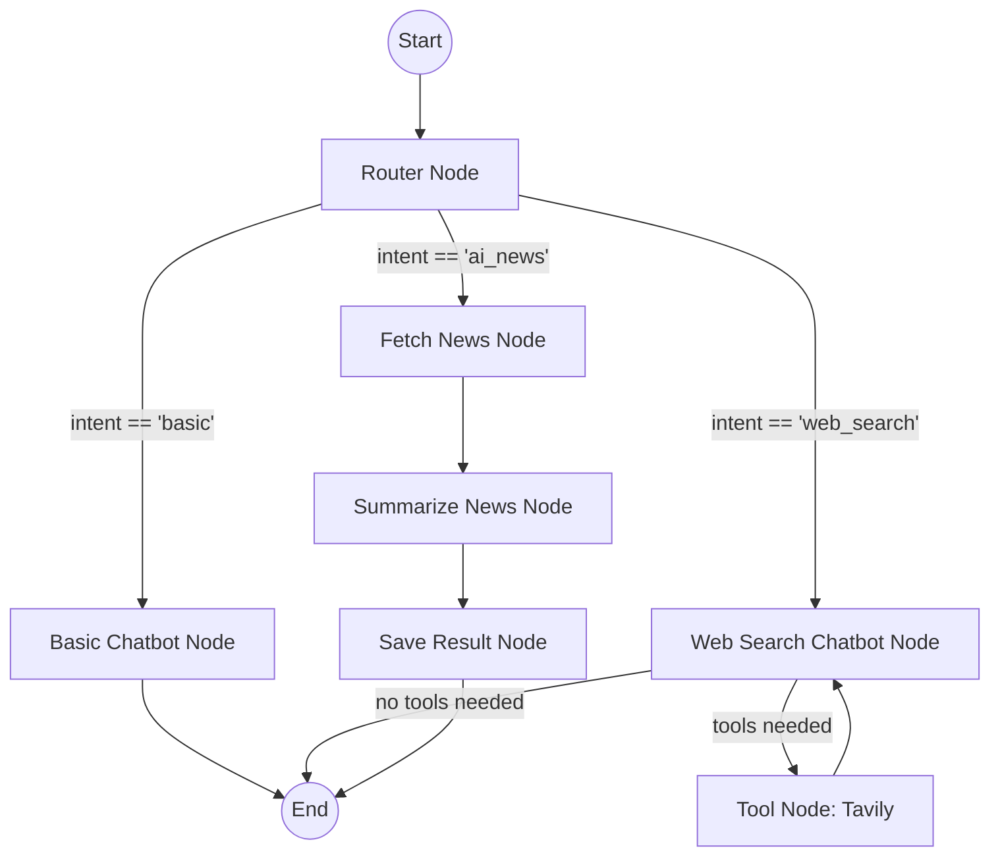

# 🚀 End-to-End Agentic AI Chatbot

## 🔧 Deployed on AWS EC2 with Jenkins CI/CD Pipeline

⚡ Production Deployment | 🧠 Multi-Agent Router | 🌐 Web-Enabled | 🐳 Dockerized | 🔁 Automated CI/CD

---

## 🌟 Project Overview

This is a **production-grade Multi-Agent AI system** built using **LangGraph** for orchestration. Unlike standard chatbots, this system features an intelligent **Supervisor Router** that dynamically classifies user intent and delegates tasks to specialized sub-agents.

### Key Capabilities:
- **Semantic Routing**: Automatically detects if the user wants to chat, search the web, or get AI news.
- **Web-Augmented Reasoning**: Real-time information retrieval using the Tavily Search API.
- **Automated AI News Pipeline**: Fetches, summarizes, and saves AI news reports locally in Markdown format.
- **Enterprise-Ready Infrastructure**: Fully containerized with Docker and deployed via a Jenkins CI/CD pipeline on AWS EC2.

---

## 🏗️ System Architecture

The core of the application is a **Stateful Multi-Agent Graph**. The **Router Node** acts as the brain, determining the execution path based on the user's message.



---

## 🧠 AI System Features

### 1️⃣ Supervisor Router (The Brain)
Using a high-performance **Llama 3.1** model via **Groq**, the router analyzes natural language to classify intent into:
- `basic`: General conversation.
- `web_search`: Factual queries requiring real-time web access.
- `ai_news`: Requests for AI industry updates (Daily/Weekly/Monthly).

### 2️⃣ Web-Enabled Agent
An autonomous agent bound to the **Tavily Search API**. It can pause its reasoning, execute web searches, and incorporate the results into a final context-aware response.

### 3️⃣ AI News ETL Pipeline
A dedicated 3-step workflow:
1. **Fetch**: Scrapes the latest AI news using specific search parameters.
2. **Summarize**: Uses LLM to condense information into a structured Markdown summary.
3. **Save**: Persists the summary to `AINews/daily_summary.md` for offline reading.

---

## 🛠️ Tech Stack

| Layer | Technology |
| --- | --- |
| **Orchestration** | LangGraph, LangChain |
| **LLM Engine** | Groq (Llama 3.3-70B, Llama 3.1-8B) |
| **Search Engine** | Tavily API |
| **UI Framework** | Streamlit |
| **Infrastructure** | Docker, AWS EC2 |
| **CI/CD** | Jenkins |

---

## 📂 Project Structure

```text
src/langgraphagenticai/
├── graph/                  # Graph orchestration & wiring
│   └── graph_builder.py    # Main StateGraph definition
├── nodes/                  # specialized Agent nodes
│   ├── router_node.py      # Supervisor logic
│   ├── basic_chatbot.py    # Standard chat
│   ├── chatbot_with_tool.py # Search-enabled chat
│   └── ai_news_node.py     # News ETL logic
├── state/                  # Shared state definitions
├── tools/                  # External tool integrations (Tavily)
├── ui/                     # Streamlit frontend components
└── main.py                 # Application entry point
```

---

## 🚀 Deployment & CI/CD

The system is hosted on **AWS EC2** and managed by **Jenkins**.

### ⚙️ CI/CD Flow:
1. **Push**: Developer pushes code to GitHub.
2. **Trigger**: GitHub Webhook notifies Jenkins.
3. **Build**: Jenkins builds a new Docker image on the EC2 instance.
4. **Deploy**: Jenkins stops the old container and spins up the new one.
5. **Verify**: Automated checks ensure the Streamlit app is live on port `8501`.

### Local Development:
```bash
# Build the image
docker build -t agentic-ai-chatbot .

# Run the container
docker run -d -p 8501:8501 --env-file .env agentic-ai-chatbot
```

---

## 👨‍💻 Author

**Sanjaysai Poloji**  
AI & Systems Engineering Enthusiast  
Cloud | DevOps | Agentic AI | Production Systems