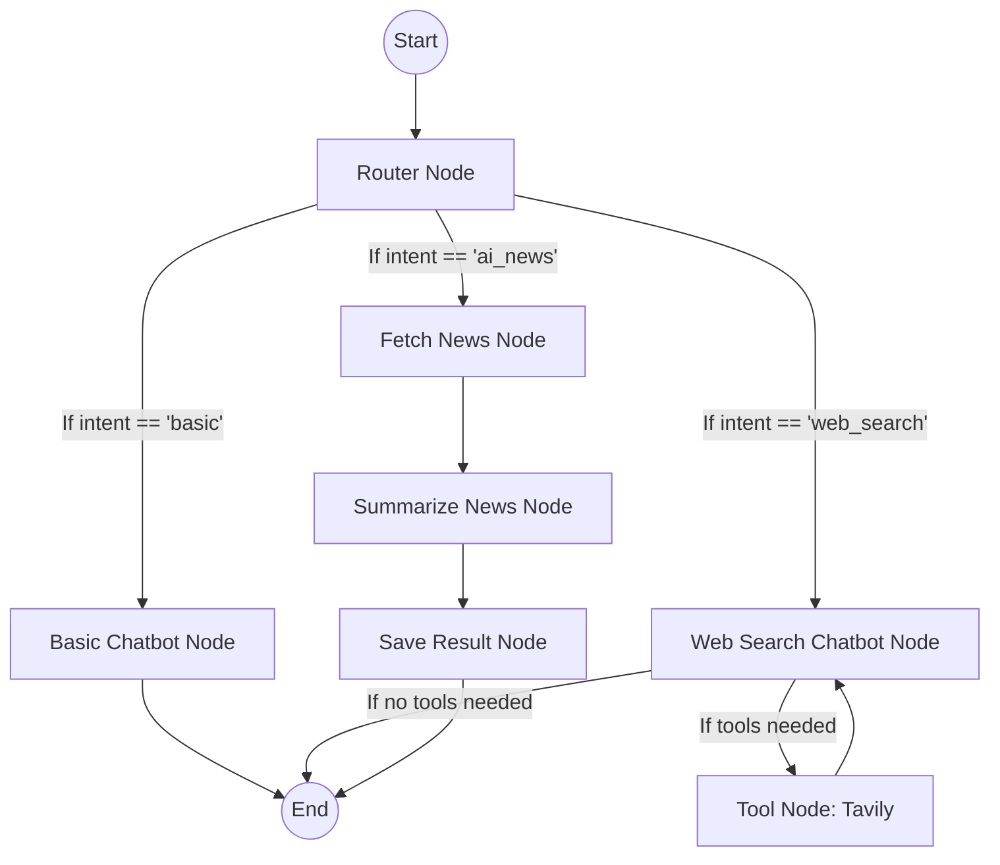

# LangGraph Agentic AI: Architecture & Interview Guide

This document breaks down the entire technical architecture of your project. It is designed to help you deeply understand how your code works so you can confidently answer technical interview questions.

---

## 1. High-Level Architecture Overview

Your project is a **Multi-Agent System** built using **LangGraph** and **Streamlit**. It takes a user's natural language input, intelligently decides what capabilities are needed to answer it, routes the request to specialized "agents" (nodes), and returns the formatted response.

### Core Tech Stack
- **Frontend**: Streamlit (for building the conversational UI).
- **Orchestration**: LangGraph (for building stateful, multi-actor LLM applications).
- **LLM Engine**: LangChain & Groq (using `llama-3.1-8b-instant` or similar models for fast inference).
- **Tools**: Tavily Search API (for real-time web scraping/searching).

---

## 2. The LangGraph State Machine (How it works)

LangGraph models applications as graphs (specifically, directed graphs). 
- **Nodes** represent functions or agents (e.g., an LLM thinking, or a Python function running a search).
- **Edges** represent the flow of data.
- **Conditional Edges** allow the system to make decisions on where to go next based on the current state.
- **State** is a shared dictionary passed between all nodes.

### The "State" (`src/langgraphagenticai/state/state.py`)
The `State` is the memory of the graph. As the graph executes, each node reads from the state and returns updates to it.
Your state tracks:
- `messages`: The chat history (Human, AI, and Tool messages).
- `intent`: What the user wants (`basic`, `web_search`, `ai_news`).
- `frequency`: Extracted timeframes for news (e.g., `daily`).

### The Graph Flow (Mermaid Diagram)

---

## 3. Component Breakdown (Directory by Directory)

### `main.py` & `app.py`
The entry point of the application. It loads the UI, gets the user's message, initializes the LLM (Groq), builds the graph, and passes the graph and user message to the display module.

### `ui/streamlitui/`
- **`loadui.py`**: Configures the Streamlit sidebar, forces the `Multi-Agent System` use case, and explicitly loads your API keys (`GROQ_API_KEY`, `TAVILY_API_KEY`) into the environment.
- **`display_result.py`**: Invokes the LangGraph state machine using `graph.invoke()`. It handles the final response dynamically depending on what the intent was (e.g., reading the generated Markdown file for AI news, or just printing chat messages).

### `nodes/` (The Agents)
- **`router_node.py` (Supervisor Agent)**: Takes the user's prompt and uses the LLM (via a system prompt asking for JSON output) to classify the user's intent. It acts as the brain that directs traffic.
- **`basic_chatbot_node.py`**: A simple pass-through to the LLM for general conversation.
- **`chatbot_with_Tool_node.py`**: Binds the Tavily tool to the LLM. If the LLM realizes it needs web data, it pauses, asks the graph to route to the `tools` node, gets the data, and resumes thinking.
- **`ai_news_node.py`**: A specialized 3-step pipeline. 
  1. `fetch_news`: Uses Tavily API explicitly to scrape AI news.
  2. `summarize_news`: Uses the LLM to format the news into a clean Markdown structure.
  3. `save_result`: Saves the Markdown string into a physical `.md` file locally.

### `graph/graph_builder.py`
This is where the graph is wired together. It defines the `StateGraph`, adds all the nodes using `add_node()`, and defines the routing logic using `add_conditional_edges()`.

---

## 4. Interview Preparation (Q&A)

Here are common questions an interviewer might ask you based on this project, and how you should answer them.

### Q: "Why did you use LangGraph instead of standard LangChain Agents?"
**Your Answer**: Standard LangChain `AgentExecutor` is great for simple loops, but it behaves like a black box. By using LangGraph, I created a deterministic state machine. I have absolute control over the execution flow. I built a Supervisor (`RouterNode`) that explicitly dictates which subgraph handles a request, which prevents the LLM from getting confused or stuck in infinite tool-calling loops. It makes the system highly extensible—if I want to add an Image Generation agent later, I just add one node and one edge.

### Q: "How does your system handle memory and state?"
**Your Answer**: I defined a TypedDict called `State` that gets passed around the graph. It uses LangGraph's `add_messages` reducer to automatically append new messages to the chat history array. I also extended the state to hold metadata like `intent` and `frequency`. Every node receives this state, processes it, and returns a dictionary of updates which LangGraph merges into the global state.

### Q: "Explain the AI News pipeline. Why is it structured differently than the Web Search agent?"
**Your Answer**: The Web Search agent uses "Tool Binding"—the LLM decides dynamically if and when to call Tavily. However, the AI News feature is a strict, predefined ETL (Extract, Transform, Load) pipeline. I explicitly wanted it to: 1. Fetch exact parameters from Tavily. 2. Pass that raw data to an LLM to format it into Markdown. 3. Save it to the filesystem. By splitting this into three distinct nodes (`fetch_news`, `summarize_news`, `save_result`) within the graph, I ensure reliability and make it easier to debug each step independently.

### Q: "How do you handle routing?"
**Your Answer**: I implemented a Semantic Router using an LLM. In `router_node.py`, the user's message is sent to the Groq LLM with a highly specific system prompt asking it to classify the intent into one of three categories (`basic`, `web_search`, `ai_news`) and return it as a structured JSON object. The graph reads this `intent` string from the state and uses a conditional edge function to dynamically branch the execution to the correct agent node.

### Q: "What challenges did you face with the API keys or environment setup?"
**Your Answer**: A key challenge was managing environment variables across Streamlit reruns. Because Streamlit reruns the script from top to bottom on every interaction, simply using `load_dotenv()` caused caching issues when keys were updated mid-session. I resolved this by enforcing `load_dotenv(override=True)` to ensure the absolute latest keys from the `.env` file are forcefully loaded into `os.environ` on every run.
